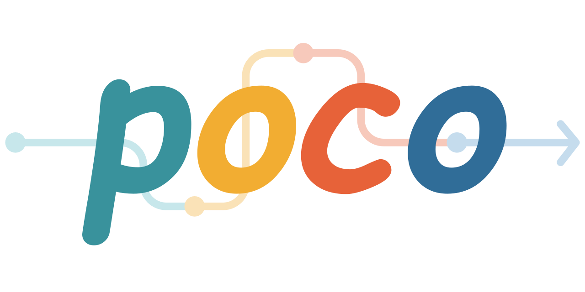

<!-- 
SPDX-FileCopyrightText: Copyright contributors to the poco project.
SPDX-License-Identifier: MIT
-->
# poco - Pocket Coroutines



[](https://github.com/kenkaijie/poco/actions/workflows/ubuntu.yml)
[](https://github.com/kenkaijie/poco/actions/workflows/windows.yml)
[](https://poco-coro.readthedocs.io/en/latest/)

This is a small toy project that produces a bare minimum cooperative task framework.

The objective is to provide a minimal framework for bare metal devices.

## Nutshell

Include poco.

```c
#include <poco/poco.h>
```

Define a coroutine.

```c
// Prints "hello world!" every 1 second.
static void my_coroutine(void *context) {
    for (;;) {
        printf("hello world!\n");
        coro_yield_delay(1000);
    }
}
```

Attach it to a scheduler and run.

```c
int main(int argc, char *argv[]) {
    // ...

    Coro *tasks[1] = {
        coro_create(my_coroutine, NULL, DEFAULT_STACK_SIZE)
        /* add other tasks */
    };

    // ...

    Scheduler *scheduler = round_robin_scheduler_create(tasks, 1);

    /* Will never return */
    scheduler_run(scheduler);
}
```

## Features

- Supports fully static allocations.
- Comprehensive coroutine aware primitives (mutex, semaphores, events, streams,
  and queues).
- Runnable on POSIX hosts for testing.

## WIP

- Basic Schedulers (Priority scheduling)
- Scheduler guidelines (tickless scheduler?)
- Generic unblocking extensions (custom primitives?)

## Should I Use This?

Probably not, the goal of this project is mostly about learning and playing around.
There are more mature solutions in this space such as:

- Zephyr, and
- FreeRTOS,

that can probably be more suited for your projects.
